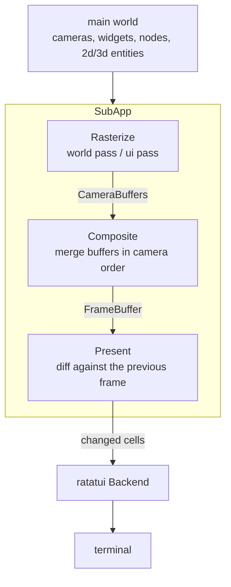

# Plurimus Architecture

Plurimus is a Bevy-native terminal renderer: a workspace of crates that render
Bevy worlds to terminal cells. The cell model is ratatui's - `Buffer`, `Cell`,
`Rect`, `Style` from ratatui-core - and the rendering model is Bevy's: any
number of systems produce drawable data throughout the frame, and exactly one
presenter writes to the terminal.

Every frame flows through the same pipeline. Terminal-relevant data is extracted
from the main world into a dedicated terminal render sub-app; pipelines
rasterize that data into per-camera buffers (world-space pipelines first, the ui
pass on top); the compositor merges camera buffers into a single frame buffer in
camera order; and the presenter diffs the composed frame against the previous
one, writing only the changed cells through a ratatui `Backend`. Multiple
`TerminalCamera`s with cell-space viewports split the terminal the way multiple
cameras split a window - a map view, a sidebar, and a minimap are three cameras
with three viewports.

Consumers adopt the workspace in tiers. Core alone renders to any `Backend`;
adding input and crossterm gives a live terminal; the ui, widgets, and bevy-ui
tiers add interaction and controls; the 2d and 3d pipelines draw world-space
entities. Each tier is a feature on the facade crate and a crate of its own.

## Crate Organization

### plurimus

The facade crate. Feature-gated re-exports of the member crates and nothing
else: `plurimus_core` is unconditional, and each feature enables one member
crate and its module (`crossterm` implies `input`; `widgets` and `bevy-ui` imply
`ui`). The default feature set is `crossterm` - core, input, and a live
terminal. The facade crate also hosts the runnable examples.

### plurimus_core

The render pipeline. `CorePlugin` installs the terminal render sub-app: an
extract schedule copies data out of the main world, then the `TerminalRender`
schedule runs its three phases - `Rasterize` (pipelines write cells into
`CameraBuffer`s, world-space passes beneath the ui pass), `Composite` (camera
buffers merge into the `FrameBuffer` in camera order), and `Present`. Core owns
`TerminalCamera` and viewport resolution against `TerminalSize`, the subcell
raster primitives in `raster` (halfblock and braille grids, blits, color
averaging, `ColorDepth` downsampling), and the widget primitive: a `UiWidget`
placed by `UiArea`/`UiCamera`/`UiOrder` is extracted and drawn in one z-sorted
pass with no other crate involved. `PresenterPlugin<B>` diffs the composed frame
and writes changed cells through any ratatui-core `Backend`. Re-exports
`ratatui_core`.

### plurimus_input

The input contract. Defines the message types a terminal backend emits into the
main world - `KeyMessage`, `MouseMessage` (cell coordinates), `PasteMessage`,
`FocusMessage` - and the state derived from them: polled `ButtonInput<KeyCode>`
and `ButtonInput<MouseButton>`, plus `CursorCell`. `InputCapabilities` records
what the active backend can report (real key releases, modifier key events - the
kitty keyboard protocol tier); where a capability is absent, release synthesis
fills the gap on a `ReleaseTimeout`. The `bevy_compat` module forwards messages
into `bevy_input` event types for crates built on them, such as the focus stack.

### plurimus_crossterm

The real terminal. `CrosstermPlugin` takes over the terminal on build - raw
mode, alternate screen, mouse capture, bracketed paste, the kitty keyboard
protocol when the terminal supports it - and restores it on exit or panic. It
detects color support from the environment, pumps crossterm events into input
messages and `TerminalResized`, and hands a `CrosstermBackend` (via
ratatui-crossterm) to core's presenter. The writer is generic: stdout by
default, or the controlling terminal directly via `CrosstermPlugin::tty()`.

### plurimus_ui

Interaction over anything with an area. `UiPlugin` computes
`ComputedWidgetArea`s, resolves hover from the cursor with z-order hit testing,
and routes pointer press/drag/release, clicks, and wheel input in three ordered
phases (`Areas`, `Hover`, `Route`). It installs focus via `bevy_input_focus`,
builds the directional navigation map, and provides scrolling (`ScrollArea`,
`ScrollOffset`, `ScrollIntoView`) with cached extraction of scrolled content,
plus the generic modal-overlay primitives (`ModalOpen`, `ModalDismiss`) that
menus and popovers are built from. Re-exports `tui_scrollview`.

### plurimus_widgets

The widget library, mirroring bevy_ui_widgets: upstream's component vocabulary
and event contract over terminal-native engines. Buttons, checkboxes, radio
groups, sliders, scrollbars, list boxes, panes, menus, popovers, a single-line
`EditableText`, and a multi-line `TextEditor` built on ratatui-textarea. Most
widgets are stateless controllers emitting entity events (`Activate`,
`ValueChange`); apps apply them, or attach the stock `*_self_update` observers
for uncontrolled behavior. Stylists render each widget from `UiTheme` every
frame. Re-exports `ratatui_widgets` and `ratatui_textarea`.

### plurimus_bui

The bevy_ui bridge. `BuiPlugin` runs bevy_ui's real layout stack - `Node` trees
computed by taffy - against terminal cameras at one pixel per cell. Only layout
runs: bevy_ui's text, focus, picking, and asset systems stay out, and text is
measured by grapheme width instead of fonts. Computed nodes rasterize in the
terminal sub-app beneath all widgets, and node areas and wheel targets bridge
into plurimus_ui's routers so bevy_ui trees are hoverable, clickable, and
scrollable like any widget.

### plurimus_2d

The software 2d pipeline. `Glyph`, `GlyphBlock`, `Pixel`, and `PixelBlock`
entities positioned by `Transform`s are projected per camera through
`Projection2d` and rasterized into camera buffers in the world-space pass.
Glyphs and pixels each draw in transform `z` order, pixels beneath all glyphs;
`PixelBlock` stamps a palette-indexed bitmap one pixel per subcell, so pixel art
composes as one entity. `SubcellMode` selects halfblock or braille resolution,
and `RenderLayers` masks which cameras see which entities.

### plurimus_3d

The GPU readback pipeline, and the only crate that pulls in bevy_render.
`Render3dPlugins` assembles a headless bevy render stack; a real 3d camera
renders to an image, `ReadbackFrame` carries the pixels back, and a `Strategy3d`
converts them to cells - halfblock colors, luminance ramps (ASCII, blocks,
braille, shading), depth ramps. Depth readback feeds `DepthOcclusion` for
cross-camera occlusion and `EdgeOverlay` for outline characters. The render
stack stops before materials: the app adds its own material system (`PbrPlugin`)
and asset loading such as `bevy_gltf`.

### plurimus_test

Dev-only test support; a dev-dependency everywhere, never shipped. Input
injection (`press_key`, `click`, and friends) writes messages as if a backend
had translated them, and `composed_frame`/`composed_styled_frame` snapshot the
composed `FrameBuffer` straight out of the sub-app - so a test drives a full app
headlessly with no terminal and no presenter attached.

## External Crates

- **Bevy** (0.19) - the ECS and app foundation, consumed as granular crates and
  never the `bevy` umbrella: `bevy_app` and `bevy_ecs` everywhere; `bevy_input`
  and `bevy_time` for the input contract; `bevy_input_focus` and `bevy_window`
  for focus; `bevy_ui`, `bevy_text`, and `bevy_camera` for the layout bridge;
  `bevy_transform` and `bevy_math` for 2d; the render stack (`bevy_render`,
  `bevy_core_pipeline`, `bevy_image`, `bevy_mesh`, `bevy_light`, and friends)
  only in `plurimus_3d`. Apps add whatever further bevy crates their scenes need
  at the same version, and cargo unifies them.
- **Ratatui** - the cell model and widget ecosystem: `ratatui-core` (0.1)
  supplies `Buffer`, `Cell`, `Rect`, `Style`, and the `Backend` seam;
  `ratatui-widgets` (0.3) the stock widget set; `ratatui-textarea` (0.9) the
  multi-line editor engine; `ratatui-crossterm` (0.1) the backend adapter the
  presenter drives.
- **crossterm** (0.29) - terminal control and the event source
  `plurimus_crossterm` translates from.
- **tui-scrollview** (0.6) - scroll-area windowing underneath `plurimus_ui`'s
  scrolling.
- **unicode-segmentation** / **unicode-width** - grapheme segmentation and width
  measurement for text handling in cells.

The minimum supported Rust version is 1.95, declared once in `workspace.package`
and verified in CI.

## Testing

Tests drive full apps headlessly. Because the presenter is `Backend`-generic and
`plurimus_test` reads the composed `FrameBuffer` directly from the render
sub-app, a test builds a real `App`, injects input as if a backend had
translated it, advances frames, and asserts on frame snapshots - no terminal
involved. Unit tests live in each crate; integration tests in `tests/` cover
cross-crate plugin composition; and every example is compiled as a test
(`test = true`), so the example suites are part of the workspace test run.

CI gates every change: `cargo fmt --all -- --check`,
`cargo clippy --workspace --all-targets --all-features -- -D warnings`,
`cargo test --workspace --all-features`, and
`RUSTDOCFLAGS="-D warnings" cargo doc --workspace --all-features --no-deps`,
plus `cargo hack check --each-feature` on the facade, a `cargo check` on the
MSRV toolchain, typos, and cargo-deny. The GPU smoke tests are `#[ignore]`d
because they need a wgpu adapter; run
`cargo test --workspace --all-features -- --ignored` when touching the 3d
stack - they are the only coverage of the headless render stack's plugin
composition.
