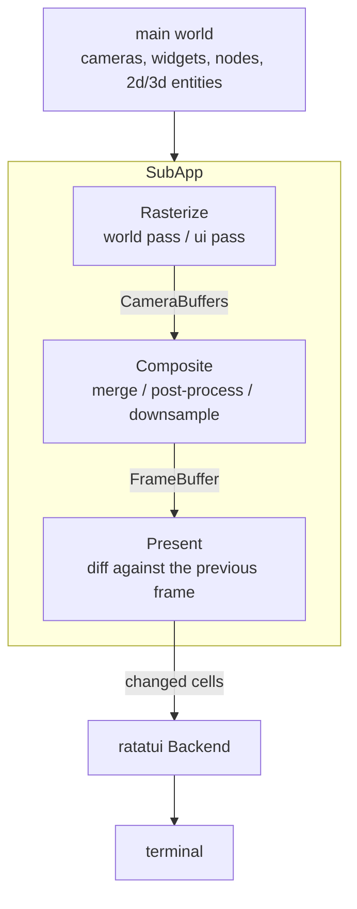

# Plurimus Architecture

Plurimus is a Bevy-native terminal renderer: a workspace of crates that render
Bevy worlds to terminal cells. The cell model is ratatui's - `Buffer`, `Cell`,
`Rect`, `Style` from ratatui-core - and the rendering model is Bevy's: any
number of systems produce drawable data throughout the frame, and exactly one
presenter writes to the terminal.

Every frame flows through the same pipeline. Terminal-relevant data is extracted
from the main world into a dedicated terminal render sub-app; pipelines
rasterize that data into per-camera buffers (world-space pipelines first, the ui
pass on top); the compositor merges camera buffers into a single frame buffer in
camera order and downsamples it to the terminal's color depth; and the presenter
diffs the composed frame against the previous one, writing only the changed
cells through a ratatui `Backend`. Multiple `TerminalCamera`s with cell-space
viewports split the terminal the way multiple cameras split a window - a map
view, a sidebar, and a minimap are three cameras with three viewports.

Consumers adopt the workspace in tiers. Core alone renders to any `Backend`;
adding input and crossterm gives a live terminal; the ui, widgets, and bevy-ui
tiers add interaction and controls; the 2d and 3d pipelines draw world-space
entities. Each tier is a feature on the facade crate and a crate of its own.

## Crate Organization

### plurimus

The facade crate. Feature-gated re-exports of the member crates and nothing
else: `plurimus_core` is unconditional, and each feature enables one member
crate and its module (`crossterm` implies `input`; `widgets` and `bevy-ui` imply
`ui`). The default feature set is `crossterm` - core, input, and a live
terminal. The facade crate also hosts the runnable examples.

### plurimus_core

The render pipeline. `CorePlugin` installs the terminal render sub-app: an
extract schedule copies data out of the main world, then the `TerminalRender`
schedule runs its three phases - `Rasterize` (pipelines write cells into
`CameraBuffer`s, world-space passes beneath the ui pass), `Composite` (camera
buffers merge into the `FrameBuffer` in camera order, apps post-process the
composed frame in `CompositeSystems::PostProcess` while colors are still what
the widgets chose, then colors downsample to the terminal's `ColorDepth`), and
`Present`. Core owns `TerminalCamera` and viewport resolution against
`TerminalSize`, the subcell raster primitives in `raster` (halfblock and braille
grids, blits, color averaging, `ColorDepth` downsampling), and the widget
primitive: a `UiWidget` placed by `UiArea`/`UiCamera`/`UiOrder` is extracted and
drawn in one z-sorted pass with no other crate involved. `PresenterPlugin<B>`
diffs the composed frame and writes changed cells through any ratatui-core
`Backend`, and applies `TerminalCursor` - the terminal's own caret, which a
screen reader follows and an input method anchors to - outside that diff,
because a caret crossing a cell changes no cell's content and the diff skips a
frame where nothing differs. Position and visibility go through `Backend`; the
shape is a backend's to serve. Re-exports `ratatui_core`.

### plurimus_input

The input contract. Defines the message types a terminal backend emits into the
main world - `KeyMessage`, `MouseMessage` (cell coordinates), `PasteMessage`,
`FocusMessage` - and the state derived from them: polled `ButtonInput<KeyCode>`
and `ButtonInput<MouseButton>`, plus `CursorCell`. `InputCapabilities` records
what the active backend can report (real key releases, modifier key events - the
kitty keyboard protocol tier); where a capability is absent, release synthesis
fills the gap on a `ReleaseTimeout`. The `bevy_compat` module forwards messages
into `bevy_input` event types for crates built on them, such as the focus stack.

### plurimus_crossterm

The real terminal. `CrosstermPlugin` takes over the terminal on build - raw
mode, alternate screen, mouse capture, bracketed paste, the kitty keyboard
protocol when the terminal supports it, focus reporting - and restores all of it
on exit or panic, the cursor shape included. It detects color support from the
environment, pumps crossterm events into input messages and `TerminalResized`,
and hands a `CrosstermBackend` (via ratatui-crossterm) to core's presenter.
Going the other way it serves `TerminalRequest` during extraction - which runs
inside the sub-app world with the main world lent in, so one system reaches both
the messages and the writer - and sets the cursor shape, which no `Backend`
method reaches. Both flush themselves, since the presenter skips its flush on a
frame where no cell differs. The writer is generic: stdout by default, or the
controlling terminal directly via `CrosstermPlugin::tty()`.

### plurimus_ui

Interaction over anything with an area. `UiPlugin` computes
`ComputedWidgetArea`s, resolves hover from the cursor with z-order hit testing,
and routes pointer press/drag/release, clicks, and wheel input in three ordered
phases (`Areas`, `Hover`, `Route`). It installs focus via `bevy_input_focus` and
pins the dispatch into that sequence - after `bevy_input`'s own update and
between `Areas` and `Hover` - so a focused-input observer reads this frame's
areas and settled key state rather than whatever the schedule happened to
resolve; work that must see what one did is ordered after the dispatch, which is
what `plurimus_widgets` does with `WidgetSystems::Layout`. It also builds the
directional navigation map, and provides scrolling (`ScrollArea`,
`ScrollOffset`, `ScrollIntoView`) with cached extraction of scrolled content,
plus the generic modal-overlay primitives (`ModalOpen`, `ModalDismiss`) that
menus and popovers are built from. `content_cell` is where a pointer cell
becomes a content cell for any of it, clamping into the area so a captured drag
past an edge keeps addressing the nearest one; `screen_cell` is the way back,
refusing rather than clamping, and it is what places the focused widget's
`WidgetCursor` on the terminal.

It also owns the styling contract entire, so a widget library reaches it without
depending on another widget library. `UiPlugin` initializes the `UiTheme`
resource, `UiTheme::resolve` turns an `InteractionState` into the one `Style`
its documented precedence gives - disabled over pressed over hovered over
normal, focused patched over the winner - and `UiStyle` and `StylistDisabled`
are the two escapes from it. Beside that vocabulary sits the engine that
consumes it: `StylistCache` records what a widget last drew and
`StylistCache::redraws` is the compare-and-swap every stylist gates on, so a
theme swap or a dirtied container repaints and an idle frame costs a comparison.
`observed` reads an entity's state through `StateQuery`, `restyle` runs the
whole loop for the label-driven case, and a `UiLabel` is a ratatui `Line`, so a
label carries per-span style of its own. Re-exports `tui_scrollview`.

### plurimus_widgets

The widget library, mirroring bevy_ui_widgets where upstream has a counterpart:
its component vocabulary and event contract over terminal-native engines.
Buttons, checkboxes, radio groups, sliders, scrollbars, list boxes, panes,
menus, popovers, a single-line `EditableText`, and a multi-line `TextEditor`
built on ratatui-textarea; `Table` is past the parity list, upstream having no
table to mirror. Most widgets are stateless controllers emitting entity events
(`Activate`, `ValueChange`); apps apply them, or attach the stock
`*_self_update` observers for uncontrolled behavior. A stylist rebuilds a
widget's `UiWidget` from `plurimus_ui`'s `UiTheme` when the state it last drew
differs from the current one, not every frame, and they run in the
`WidgetSystems::Style` set an app orders its own against. Only the stylists
themselves are the crate's: the cache they gate on, the state they read, the
label they draw, and the theme vocabulary the app speaks all belong to
`plurimus_ui`, which is what lets a widget family outside this workspace be
written against the same engine. `StylistDisabled` exempts an entity so an app
takes its look while keeping its behavior, and `UiStyle` patches over the style
an entity would otherwise resolve to, on a widget or on one list or table row.

The two widgets drawn from row children - the list box and the table - carry a
second change signal beside that one. Their rows are child entities, and a
child's change never marks its parent, so one generic pass in
`WidgetSystems::Layout` forwards a row's edit, restyle, check, or uncheck to the
container before any stylist runs, and a second sums its rows' heights into the
scroll extent, reading that same signal so a row's edit resizes the content in
the frame it happens. A stylist reads it too, rather than hashing every row to
find out, which is what keeps a settled list of any length free on an idle
frame. A row is one terminal row tall unless it carries `ListItemText`, which
only a list box draws: that row is as tall as its text has lines, and the
extent, the row a click lands in, and the reveal that keeps the cursor visible
all measure by height rather than by count. Both containers also take their
movement keys from a component of `(Key, Action)` bindings - `ListBoxKeys`,
`TableKeys` - scanned in order so the first match wins, which is how an app
remaps a list to vim keys without reimplementing movement beside the widget; the
sliders, menus, and text widgets still match keys inline.

A `Table`'s rows are child entities holding their own cells, banded by
`TableHeader` and `TableFooter` and striped by `TableStripe`. Interaction is
opt-in: `TableSelection` makes the table a tab stop and chooses row, column, or
cell granularity. A header click reports its column so the app can sort - the
crate supplies the geometry and never the ordering. Because a scroll area
windows a widget whole, a scrolled table's bands scroll with its body.

Re-exports `ratatui_widgets`, `ratatui_textarea`, and `bevy_input`'s `Key`.

### plurimus_bui

The bevy_ui bridge. `BuiPlugin` runs bevy_ui's real layout stack - `Node` trees
computed by taffy - against terminal cameras at one pixel per cell. Only layout
runs: bevy_ui's text, focus, picking, and asset systems stay out, and text is
measured by grapheme width instead of fonts. Computed nodes rasterize in the
terminal sub-app beneath all widgets, and node areas and wheel targets bridge
into plurimus_ui's routers so bevy_ui trees are hoverable, clickable, and
scrollable like any widget.

### plurimus_2d

The software 2d pipeline. `Glyph`, `GlyphBlock`, `Pixel`, and `PixelBlock`
entities positioned by `Transform`s are projected per camera through
`Projection2d` and rasterized into camera buffers in the world-space pass.
Glyphs and pixels each draw in transform `z` order, pixels beneath all glyphs;
`PixelBlock` stamps a palette-indexed bitmap one pixel per subcell, so pixel art
composes as one entity. `SubcellMode` selects halfblock or braille resolution,
and `RenderLayers` masks which cameras see which entities.

### plurimus_3d

The GPU readback pipeline, and the only crate that pulls in bevy_render.
`Render3dPlugins` assembles a headless bevy render stack; a real 3d camera
renders to an image, `ReadbackFrame` carries the pixels back, and a `Strategy3d`
converts them to cells - halfblock colors, luminance ramps (ASCII, blocks,
braille, shading), depth ramps. Depth readback feeds `DepthOcclusion` for
cross-camera occlusion and `EdgeOverlay` for outline characters. The render
stack stops before materials: the app adds its own material system (`PbrPlugin`)
and asset loading such as `bevy_gltf`.

### plurimus_test

Dev-only test support; a dev-dependency everywhere, never shipped. Input
injection (`press_key`, `click`, and friends) writes messages as if a backend
had translated them, and `composed_frame`/`composed_styled_frame` snapshot the
composed `FrameBuffer` straight out of the sub-app - so a test drives a full app
headlessly with no terminal and no presenter attached. `widget_content` hands
back the drawable an entity currently holds, which is how a test tells a redraw
from a skipped one.

## External Crates

- **Bevy** (0.19) - the ECS and app foundation, consumed as granular crates and
  never the `bevy` umbrella: `bevy_app` and `bevy_ecs` everywhere; `bevy_input`
  and `bevy_time` for the input contract; `bevy_input_focus` and `bevy_window`
  for focus; `bevy_ui`, `bevy_text`, and `bevy_camera` for the layout bridge;
  `bevy_transform` and `bevy_math` for 2d; the render stack (`bevy_render`,
  `bevy_core_pipeline`, `bevy_image`, `bevy_mesh`, `bevy_light`, and friends)
  only in `plurimus_3d`. Apps add whatever further bevy crates their scenes need
  at the same version, and cargo unifies them.
- **Ratatui** - the cell model and widget ecosystem: `ratatui-core` (0.1)
  supplies `Buffer`, `Cell`, `Rect`, `Style`, and the `Backend` seam;
  `ratatui-widgets` (0.3) the stock widget set; `ratatui-textarea` (0.9) the
  multi-line editor engine; `ratatui-crossterm` (0.1) the backend adapter the
  presenter drives.
- **crossterm** (0.29) - terminal control and the event source
  `plurimus_crossterm` translates from.
- **tui-scrollview** (0.6) - scroll-area windowing underneath `plurimus_ui`'s
  scrolling.
- **unicode-segmentation** / **unicode-width** - grapheme segmentation and width
  measurement for text handling in cells.

The minimum supported Rust version is 1.95, declared once in `workspace.package`
and verified in CI.

## Testing

Tests drive full apps headlessly. Because the presenter is `Backend`-generic and
`plurimus_test` reads the composed `FrameBuffer` directly from the render
sub-app, a test builds a real `App`, injects input as if a backend had
translated it, advances frames, and asserts on frame snapshots - no terminal
involved. Unit tests live in each crate; integration tests in `tests/` cover
cross-crate plugin composition; and every example is compiled as a test
(`test = true`), so the example suites are part of the workspace test run.

CI gates every change: `cargo fmt --all -- --check`,
`cargo clippy --workspace --all-targets --all-features -- -D warnings`,
`cargo test --workspace --all-features`, and
`RUSTDOCFLAGS="-D warnings" cargo doc --workspace --all-features --no-deps`,
plus `cargo hack check --each-feature` on the facade, a `cargo check` on the
MSRV toolchain, prettier and markdownlint over the markdown, typos, cargo-deny,
and cargo-semver-checks. The GPU smoke tests are `#[ignore]`d because they need
a wgpu adapter; run `cargo test --workspace --all-features -- --ignored` when
touching the 3d stack - they are the only coverage of the headless render
stack's plugin composition.

Because clippy runs with `-D warnings`, the lint configuration is a gate rather
than advice. `[workspace.lints]`, inherited by every crate, warns `missing_docs`
and clippy's `pedantic` group alongside `style`, `complexity`, `perf`, and
`suspicious`, denies `correctness`, and selects `missing_const_for_fn` and
`redundant_clone` out of `nursery`. The lints a terminal renderer cannot honor
are allowed at the workspace with the reason inline: the four narrowing-cast
lints, `needless_pass_by_value`, `type_complexity`, `float_cmp`, and
`match_bool`. `clippy.toml` carries the hard tier of the project's size limits -
50 lines per function, 5 parameters, 5 levels of nesting - so a breach fails the
build; file length has no lint and is enforced by review.
